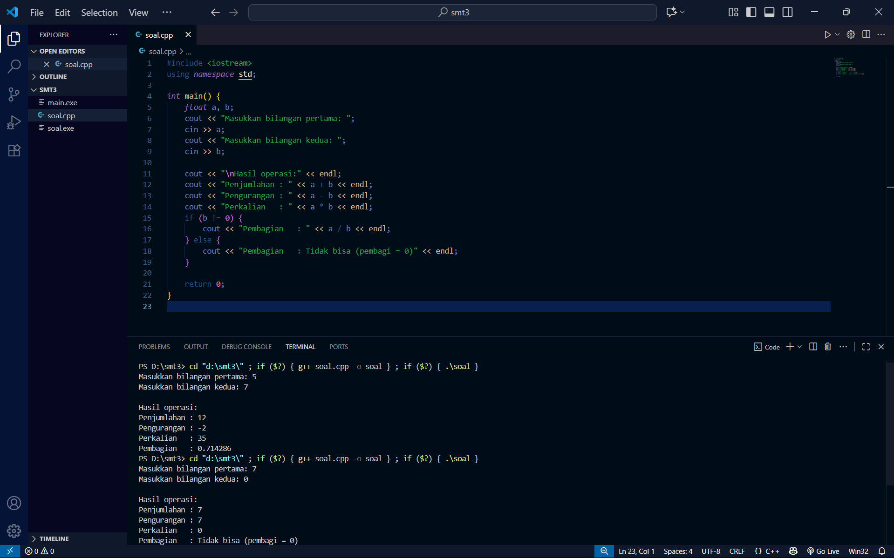
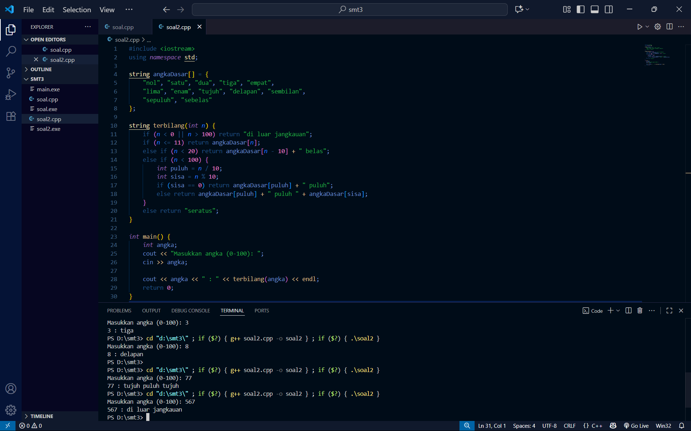
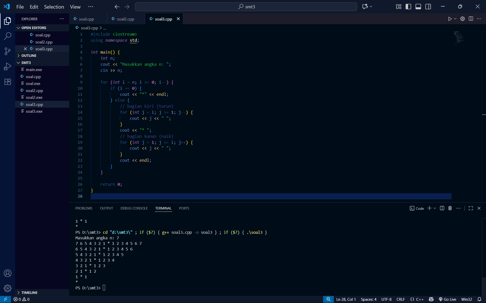

# <h1 align="center">Laporan Praktikum Modul 1 <br> Pengenalan C++</h1>
<p align="center">Hafis Akbar Anugrah - 103112400125</p>

## Dasar Teori

Dalam bahasa C++, ada sejumlah konsep fundamental yang biasanya dipelajari sejak awal. Struct dipakai untuk mengelompokkan beberapa variabel dengan tipe data yang berbeda ke dalam satu kesatuan, sehingga pengelolaan data jadi lebih teratur. Operator aritmatika seperti +, -, *, /, dan % digunakan untuk melakukan perhitungan matematika pada program. Percabangan (if, else if, else, atau switch) memungkinkan program mengambil keputusan dan mengeksekusi bagian kode tertentu sesuai dengan kondisi yang terpenuhi. Perulangan (for, while, do while) berfungsi untuk menjalankan potongan kode berkali-kali tanpa harus menuliskannya berulang. Sedangkan fungsi merupakan sekumpulan perintah yang dikemas dalam satu blok dan bisa dipanggil kapan saja, sehingga kode lebih tersusun rapi, mudah dipahami, dan bisa digunakan kembali.
## Unguided
## Guided

### soal 1
```go
#include <iostream>
#include <string>
using namespace std;

// Definisi struct
struct Mahasiswa {
    string nama;
    string nim;
    float ipk;
};

int main() {

    Mahasiswa mhs1;

    cout << "Masukkan Nama Mahasiswa: ";
    getline(cin, mhs1.nama);
    // cin >> mhs1.nama;
    cout << "Masukkan NIM Mahasiswa : ";
    cin >> mhs1.nim;
    cout << "Masukkan IPK Mahasiswa : ";
    cin >> mhs1.ipk;

    cout << "\n=== Data Mahasiswa ===" << endl;
    cout << "Nama : " << mhs1.nama << endl;
    cout << "NIM  : " << mhs1.nim << endl;
    cout << "IPK  : " << mhs1.ipk << endl;

    return 0;
}
```

### soal 2
```go
#include <iostream>
using namespace std;
int main()
{
    int W, X, Y;
    float Z;
    X = 7;
    Y = 3;
    W = 1;
    Z = (X + Y) / (Y + W);
    cout << "Nilai z = " << Z << endl;
    return 0;
}
```

### soal 3
```go
#include <iostream>
using namespace std;

int main()
{
    int kode_hari;
    cout << "Menentukan hari kerja/libur\n"<<endl;
    cout << "1=Senin 3=Rabu 5=Jumat 7=Minggu "<<endl;
    cout << "2=Selasa 4=Kamis 6=Sabtu "<<endl;
    cin >> kode_hari;
    switch (kode_hari)
    {
    case 1:
    case 2:
    case 3:
    case 4:
    case 5:
        cout<<"Hari Kerja";
        break;
    case 6:
    case 7:
        cout<<"Hari Libur";
        break;
    default:
        cout<<"Kode masukan salah!!!";
    }
    return 0;
}
```

### soal 4
```go
#include <iostream>
using namespace std;

int main()
{
    int i = 1;
    int jum;
    cin >> jum;
    do
    {
        cout << "bahlil ke-" << (i + 1) << endl;
        i++;
    } while (i < jum);
    return 0;
}
```

### soal 5
```go
#include <iostream>
using namespace std;

// Prosedur: hanya menampilkan hasil, tidak mengembalikan nilai
void tampilkanHasil(double p, double l)
{
    cout << "\n=== Hasil Perhitungan ===" << endl;
    cout << "Panjang : " << p << endl;
    cout << "Lebar   : " << l << endl;
    cout << "Luas    : " << p * l << endl;
    cout << "Keliling: " << 2 * (p + l) << endl;
}

// Fungsi: mengembalikan nilai luas
double hitungLuas(double p, double l)
{
    return p * l;
}

// Fungsi: mengembalikan nilai keliling
double hitungKeliling(double p, double l)
{
    return 2 * (p + l);
}

int main()
{
    double panjang, lebar;

    cout << "Masukkan panjang: ";
    cin >> panjang;
    cout << "Masukkan lebar  : ";
    cin >> lebar;

    // Panggil fungsi
    double luas = hitungLuas(panjang, lebar);
    double keliling = hitungKeliling(panjang, lebar);

    cout << "\nDihitung dengan fungsi:" << endl;
    cout << "Luas      = " << luas << endl;
    cout << "Keliling  = " << keliling << endl;

    // Panggil prosedur
    tampilkanHasil(panjang, lebar);

    return 0;
}

```

### soal 6
```go
#include <iostream>
using namespace std;
int main()
{
    string ch;
    cout << "Masukkan sebuah karakter: ";
    // cin >> ch;
    ch = getchar();  //Menggunakan getchar() untuk membaca satu karakter
    cout << "Karakter yang Anda masukkan adalah: " << ch << endl;
    return 0;
}
```


## Unguided

### Soal 1

copy paste soal nomor 1 disini

```go
#include <iostream>
using namespace std;

int main() {
    float a, b;
    cout << "Masukkan bilangan pertama: ";
    cin >> a;
    cout << "Masukkan bilangan kedua: ";
    cin >> b;

    cout << "\nHasil operasi:" << endl;
    cout << "Penjumlahan : " << a + b << endl;
    cout << "Pengurangan : " << a - b << endl;
    cout << "Perkalian   : " << a * b << endl;
    if (b != 0) {
        cout << "Pembagian   : " << a / b << endl;
    } else {
        cout << "Pembagian   : Tidak bisa (pembagi = 0)" << endl;
    }

    return 0;
}

```

> Output
> 

Penjelasan : Program ini menghitung penjumlahan, pengurangan, perkalian, dan pembagian dari dua bilangan. Jika pembaginya nol, ditampilkan pesan error. Konsep: operator aritmatika, if, input-output.

### Soal 2

soal nomor 2A

```go
#include <iostream>
using namespace std;

string angkaDasar[] = {
    "nol", "satu", "dua", "tiga", "empat",
    "lima", "enam", "tujuh", "delapan", "sembilan",
    "sepuluh", "sebelas"
};

string terbilang(int n) {
    if (n < 0 || n > 100) return "di luar jangkauan";
    if (n <= 11) return angkaDasar[n];
    else if (n < 20) return angkaDasar[n - 10] + " belas";
    else if (n < 100) {
        int puluh = n / 10;
        int sisa = n % 10;
        if (sisa == 0) return angkaDasar[puluh] + " puluh";
        else return angkaDasar[puluh] + " puluh " + angkaDasar[sisa];
    }
    else return "seratus";
}

int main() {
    int angka;
    cout << "Masukkan angka (0-100): ";
    cin >> angka;

    cout << angka << " : " << terbilang(angka) << endl;
    return 0;
}

```

> Output
> 

Penjelasan : Mengubah angka 0 sampai 100 menjadi bentuk kata (misal: 15 → “lima belas”). Program pakai fungsi terbilang(), array string, dan if-else untuk menentukan aturan penulisan.

Kalau adalanjutan di lanjut disini aja

soal nomor 2B

```go
#include <iostream>
using namespace std;

int main() {
    int n;
    cout << "Masukkan angka n: ";
    cin >> n;

    for (int i = n; i >= 0; i--) {
        if (i == 0) {
            cout << "*" << endl;
        } else {
            // bagian kiri (turun)
            for (int j = i; j >= 1; j--) {
                cout << j << " ";
            }
            cout << "* ";
            // bagian kanan (naik)
            for (int j = 1; j <= i; j++) {
                cout << j << " ";
            }
            cout << endl;
        }
    }

    return 0;
}

```

> Output
> 

Penjelasan : Mencetak pola angka menurun di kiri, bintang di tengah, lalu angka menaik di kanan. Menggunakan perulangan bersarang (nested loop) dan if untuk baris terakhir.

## Referensi

1. https://www.w3schools.com/cpp/cpp_for_loop.asp
2. https://www.w3schools.com/cpp/cpp_conditions.asp
