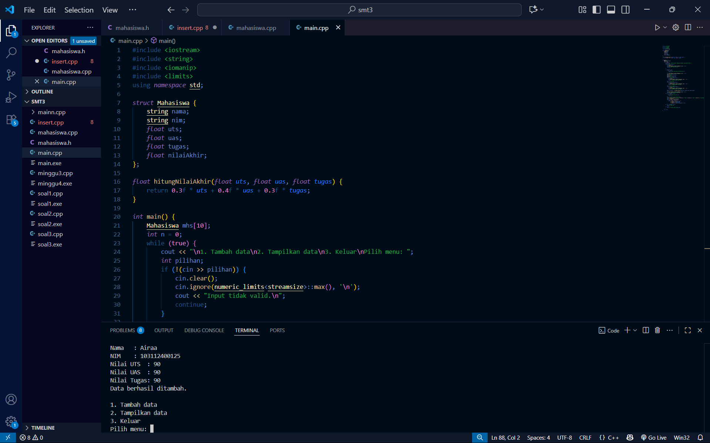
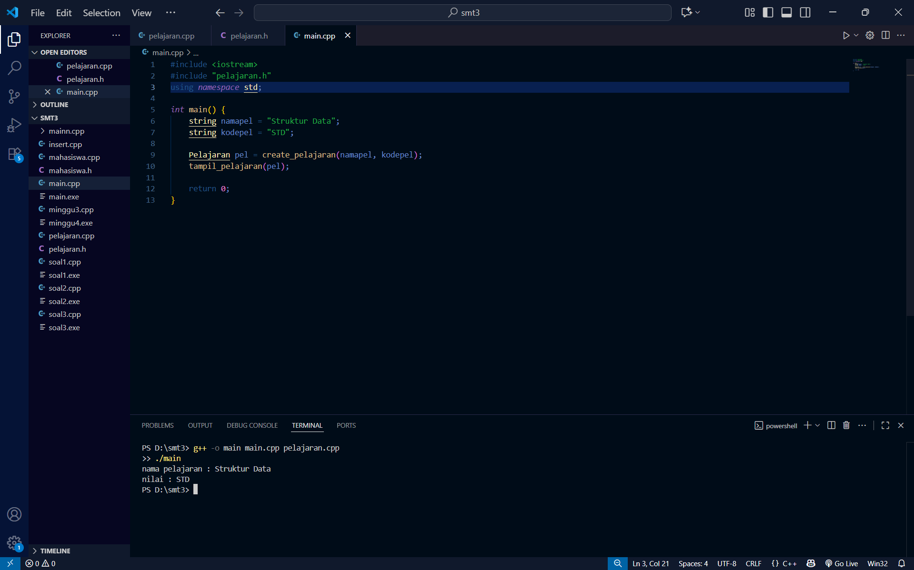
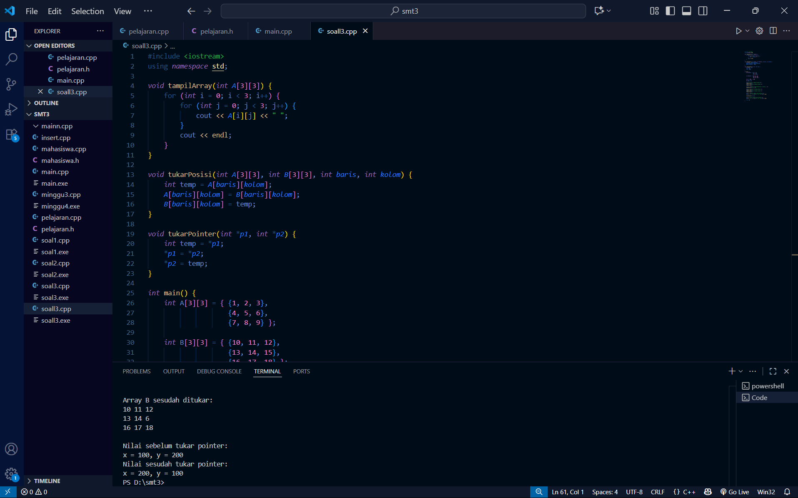

# <h1 align="center">Laporan Praktikum Modul 3 <br> Abstract Data Type
</h1>
<p align="center">Hafis Akbar Anugrah - 103112400125</p>

## Dasar Teori
Abstract Data Type (ADT) adalah konsep dalam pemrograman yang mendefinisikan suatu tipe data beserta kumpulan operasi dasar yang dapat dilakukan terhadapnya, tanpa memperlihatkan detail implementasi di dalamnya. Fokus utama ADT terletak pada “apa yang dilakukan” oleh operasi, bukan “bagaimana cara melakukannya”, sehingga terdapat pemisahan jelas antara spesifikasi perilaku dan implementasi aktual. Dalam penerapannya, ADT umumnya dibagi menjadi dua bagian utama: file header (.h) yang memuat deklarasi tipe data serta prototipe fungsi/prosedur, dan file implementasi (.cpp) yang berisi kode lengkap dari setiap operasi yang didefinisikan. Dengan pendekatan ini, pengguna dapat menggunakan tipe data melalui antarmuka yang telah ditentukan tanpa perlu memahami detail internalnya. Hal ini mendukung prinsip modularitas, abstraksi, dan kemudahan pemeliharaan dalam pengembangan perangkat lunak.
## Guide

## Menghitung rata rata mahasiswa.h
```go
#ifndef MAHASISWA_H_INCLUDED
#define MAHASISWA_H_INCLUDED

struct mahasiswa
{
    char nim[10];
    int nilai1, nilai2;
};

void inputMhs(mahasiswa &m);
float rata2(mahasiswa m);

#endif

```

## Mahasiswa.cpp
```go
#include "mahasiswa.h"
#include <iostream>
using namespace std;

void inputMhs(mahasiswa &m)
{
    cout << "input nama = ";
    cin >> (m) .nim;
    cout << "input nilai = ";
    cin >> (m) .nilai1;
    cout << "input niali2 = ";
    cin >> m .nilai2;

}
float rata2(mahasiswa m)
{
    return float(m.nilai1 + m.nilai2) / 2;

```

## main.cpp
```go
#include <iostream>
#include "mahasiswa.h"
using namespace std;

int main(){
    mahasiswa mhs;
    inputMhs(mhs);
    cout << "rata rata = " << rata2(mhs);
    return 0;
}

```


## Unguide

### Soal 1

Buat program yang dapat menyimpan data mahasiswa (max. 10) ke dalam sebuah array
dengan field nama, nim, uts, uas, tugas, dan nilai akhir. Nilai akhir diperoleh dari FUNGSI
dengan rumus 0.3*uts+0.4*uas+0.3*tugas.
```go
#include <iostream>
#include <string>
#include <iomanip>
#include <limits>
using namespace std;

struct Mahasiswa {
    string nama;
    string nim;
    float uts;
    float uas;
    float tugas;
    float nilaiAkhir;
};

float hitungNilaiAkhir(float uts, float uas, float tugas) {
    return 0.3f * uts + 0.4f * uas + 0.3f * tugas;
}

int main() {
    Mahasiswa mhs[10];
    int n = 0;
    while (true) {
        cout << "\n1. Tambah data\n2. Tampilkan data\n3. Keluar\nPilih menu: ";
        int pilihan;
        if (!(cin >> pilihan)) {
            cin.clear();
            cin.ignore(numeric_limits<streamsize>::max(), '\n');
            cout << "Input tidak valid.\n";
            continue;
        }

        if (pilihan == 1) {
            if (n >= 10) {
                cout << "Data penuh (maks 10 mahasiswa).\n";
                continue;
            }
            cin.ignore(numeric_limits<streamsize>::max(), '\n');
            cout << "Nama   : ";
            getline(cin, mhs[n].nama);
            cout << "NIM    : ";
            getline(cin, mhs[n].nim);
            cout << "Nilai UTS  : ";
            while (!(cin >> mhs[n].uts)) {
                cin.clear();
                cin.ignore(numeric_limits<streamsize>::max(), '\n');
                cout << "Masukkan angka untuk UTS: ";
            }
            cout << "Nilai UAS  : ";
            while (!(cin >> mhs[n].uas)) {
                cin.clear();
                cin.ignore(numeric_limits<streamsize>::max(), '\n');
                cout << "Masukkan angka untuk UAS: ";
            }
            cout << "Nilai Tugas: ";
            while (!(cin >> mhs[n].tugas)) {
                cin.clear();
                cin.ignore(numeric_limits<streamsize>::max(), '\n');
                cout << "Masukkan angka untuk Tugas: ";
            }
            mhs[n].nilaiAkhir = hitungNilaiAkhir(mhs[n].uts, mhs[n].uas, mhs[n].tugas);
            n++;
            cin.ignore(numeric_limits<streamsize>::max(), '\n');
            cout << "Data berhasil ditambah.\n";
        } else if (pilihan == 2) {
            if (n == 0) {
                cout << "Belum ada data.\n";
                continue;
            }
            cout << "\nDaftar Nilai Mahasiswa\n";
            cout << left << setw(4) << "No" << setw(25) << "Nama" << setw(12) << "NIM" << setw(10) << "NilaiAkhir" << '\n';
            cout << string(55, '-') << '\n';
            cout << fixed << setprecision(2);
            for (int i = 0; i < n; ++i) {
                cout << left << setw(4) << (i + 1)
                     << setw(25) << mhs[i].nama
                     << setw(12) << mhs[i].nim
                     << setw(10) << mhs[i].nilaiAkhir << '\n';
            }
        } else if (pilihan == 3) {
            cout << "Keluar.\n";
            break;
        } else {
            cout << "Pilihan tidak tersedia.\n";
        }
    }
    return 0;
}
```

> Output
> 
### Soal 2
Buatlah ADT Pelajaran sebagai berikut di dalam file "pelajaran.h"
```go
goType pelajaran <
namaMapel : string
kodeMapel : string
>
function create_pelajaran( namapel : string,
kodepel : string ) → pelajaran
procedure tampil_pelajaran( input pel : pelajaran )
```
Buatlah implementasi ADT pelajaran pada file “pelajaran.cpp”

Cobalah hasil implementasi ADT pada file “main.cpp”
# pelajaran.h
```go
#ifndef PELAJARAN_H_INCLUDED
#define PELAJARAN_H_INCLUDED
#include <string>
using namespace std;

struct Pelajaran {
    string namaMapel;
    string kodeMapel;
};

Pelajaran create_pelajaran(string namapel, string kodepel);
void tampil_pelajaran(Pelajaran pel);

#endif
```

# pelajaran.cpp
```go
#include <iostream>
#include "pelajaran.h"
using namespace std;

Pelajaran create_pelajaran(string namapel, string kodepel) {
    Pelajaran p;
    p.namaMapel = namapel;
    p.kodeMapel = kodepel;
    return p;
}

void tampil_pelajaran(Pelajaran pel) {
    cout << "nama pelajaran : " << pel.namaMapel << endl;
    cout << "nilai : " << pel.kodeMapel << endl;
}
```

# main.cpp
```go
#include <iostream>
#include "pelajaran.h"
using namespace std;

int main() {
    string namapel = "Struktur Data";
    string kodepel = "STD";

    Pelajaran pel = create_pelajaran(namapel, kodepel);
    tampil_pelajaran(pel);

    return 0;
}
```

> Output
> 

Program ini merupakan contoh penerapan **konsep Abstract Data Type (ADT)** dalam bahasa C++, di mana terdapat pemisahan antara **definisi tipe data**, **implementasi fungsi**, dan **program utama untuk pengujian**.
Pada file **pelajaran.h**, dideklarasikan tipe data `struct Pelajaran` dengan dua atribut, yaitu `namaMapel` dan `kodeMapel`, serta deklarasi dua fungsi, `create_pelajaran()` dan `tampil_pelajaran()`.
File **pelajaran.cpp** berisi **realisasi dari fungsi-fungsi tersebut** — `create_pelajaran()` berfungsi membuat objek pelajaran baru dengan mengisi nama dan kode, sedangkan `tampil_pelajaran()` digunakan untuk menampilkan informasi pelajaran.
File **main.cpp** berperan sebagai **program utama** yang menguji ADT dengan membuat dan menampilkan objek pelajaran menggunakan fungsi yang telah didefinisikan.
Struktur seperti ini menjadikan program **lebih terorganisir, mudah dikembangkan**, dan sesuai dengan **prinsip utama ADT**, yaitu pemisahan antara **spesifikasi** dan **implementasi**.

### Soal 3
Buatlah program dengan ketentuan :
- 2 buah array 2D integer berukuran 3x3 dan 2 buah pointer integer
- fungsi/prosedur yang menampilkan isi sebuah array integer 2D
- fungsi/prosedur yang akan menukarkan isi dari 2 array integer 2D pada posisi tertentu
- fungsi/prosedur yang akan menukarkan isi dari variabel yang ditunjuk oleh 2 buah
pointer

```
#include <iostream>
using namespace std;

void tampilArray(int A[3][3]) {
    for (int i = 0; i < 3; i++) {
        for (int j = 0; j < 3; j++) {
            cout << A[i][j] << " ";
        }
        cout << endl;
    }
}

void tukarPosisi(int A[3][3], int B[3][3], int baris, int kolom) {
    int temp = A[baris][kolom];
    A[baris][kolom] = B[baris][kolom];
    B[baris][kolom] = temp;
}

void tukarPointer(int *p1, int *p2) {
    int temp = *p1;
    *p1 = *p2;
    *p2 = temp;
}

int main() {
    int A[3][3] = { {1, 2, 3},
                    {4, 5, 6},
                    {7, 8, 9} };

    int B[3][3] = { {10, 11, 12},
                    {13, 14, 15},
                    {16, 17, 18} };

    int x = 100, y = 200;
    int *p1 = &x;
    int *p2 = &y;

    cout << "Array A sebelum ditukar:\n";
    tampilArray(A);
    cout << "\nArray B sebelum ditukar:\n";
    tampilArray(B);

    cout << "\nMenukar elemen pada baris 1 kolom 2...\n";
    tukarPosisi(A, B, 1, 2);

    cout << "\nArray A sesudah ditukar:\n";
    tampilArray(A);
    cout << "\nArray B sesudah ditukar:\n";
    tampilArray(B);

    cout << "\nNilai sebelum tukar pointer:\n";
    cout << "x = " << *p1 << ", y = " << *p2 << endl;

    tukarPointer(p1, p2);

    cout << "Nilai sesudah tukar pointer:\n";
    cout << "x = " << *p1 << ", y = " << *p2 << endl;

    return 0;
}
```
> Output
> 

Program di atas merupakan program C++ yang menggunakan **array 2 dimensi dan pointer** untuk mendemonstrasikan konsep pertukaran nilai. Program diawali dengan deklarasi dua buah array 2D berukuran 3x3 bernama `A` dan `B`, masing-masing berisi nilai-nilai berbeda. Fungsi `tampilArray()` digunakan untuk menampilkan isi dari sebuah array 3x3 ke layar. Fungsi `tukarPosisi()` berfungsi untuk menukar elemen pada posisi tertentu antara dua array, misalnya elemen di baris ke-1 dan kolom ke-2 dari `A` ditukar dengan elemen di posisi yang sama pada `B`. Selain itu, terdapat fungsi `tukarPointer()` yang menukar nilai dari dua variabel melalui pointer. Pada fungsi `main()`, program menampilkan isi awal kedua array, kemudian melakukan pertukaran elemen dengan `tukarPosisi()`, lalu menampilkan hasil setelah pertukaran. Selanjutnya, dua variabel `x` dan `y` yang diakses melalui pointer `p1` dan `p2` juga ditukar nilainya menggunakan fungsi `tukarPointer()`. Hasil akhirnya menunjukkan bahwa elemen array serta nilai variabel berhasil ditukar sesuai instruksi, menggambarkan penggunaan fungsi, array 2D, dan pointer dalam satu program yang terstruktur.

## Referensi

1. https://www.w3schools.com/dsa/dsa_intro.php
2. https://www.w3schools.com/cpp/cpp_data_structures.asp
3. https://www.w3schools.com/cpp/cpp_structs.asp
4. https://www.w3schools.com/cpp/cpp_data_types.asp
